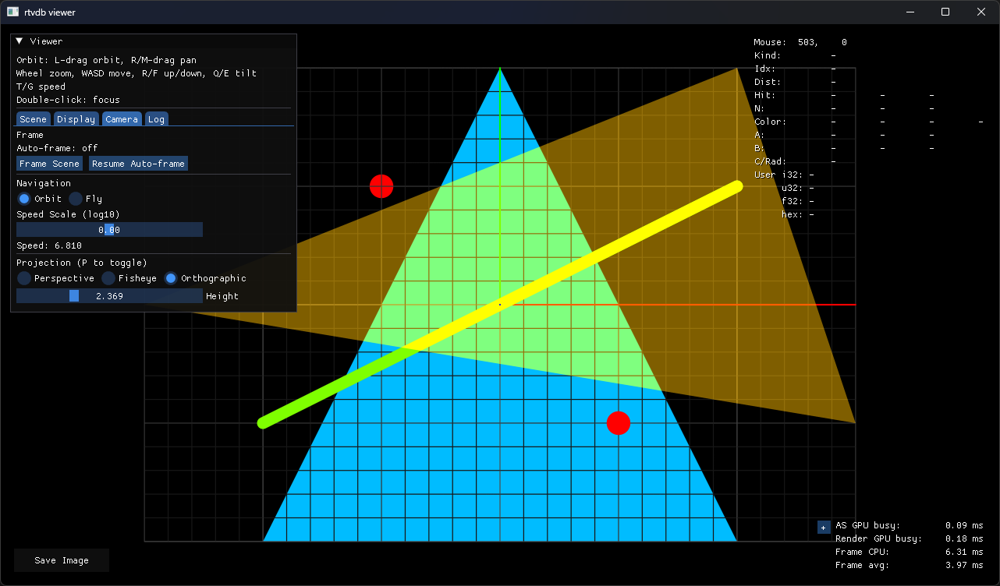
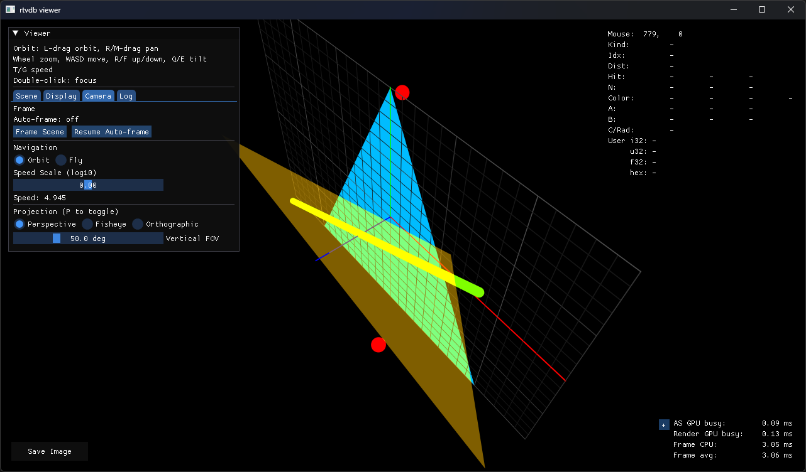

# rtvdb

[`rtvdb`](https://github.com/shocker-0x15/rtvdb) は、クライアントアプリからビューワーへ 3D デバッグ描画を送るためのシングルヘッダーライブラリです。\
[`rtvdb`](https://github.com/shocker-0x15/rtvdb) is a single-header library for sending 3D debug drawing from client applications to a viewer.

デフォルトではクライアントとビューワーは同一マシン上で動作させますが、別マシンで動作させることもできます。\
By default, the client and viewer run on the same machine, but they can also run on separate machines.

このプロジェクトは [vdb: the printf of visual debugging (zdevito)](https://github.com/zdevito/vdb) から着想を得て作られています。\
This project was inspired by [vdb: the printf of visual debugging (zdevito)](https://github.com/zdevito/vdb).

## Examples

クライアント組み込み例 / Client integration example
```cpp
#define RTVDB_IMPLEMENTATION
#include "rtvdb/rtvdb.h"

int main() {
    rtvdb::set_color(0.0f, 0.5f, 1.0f);
    rtvdb::triangle(
        -1.0f, -1.0f, 0.0f,
        1.0f, -1.0f, 0.0f,
        0.0f, 1.0f, 0.0f);

    rtvdb::set_color(1.0f, 0.5f, 0.0f, 0.5f);
    rtvdb::triangle(
        -1.5f, 0.0f, 0.5f,
        1.5f, -0.5f, 0.5f,
        1.0f, 1.0f, 0.5f);

    rtvdb::set_color(0.5f, 1.0f, 0.0f);
    rtvdb::set_line_radius(0.025f);
    rtvdb::line(-1.0f, -0.5f, 0.25f, 1.0f, 0.5f, 0.25f);

    rtvdb::set_color(1.0f, 0.0f, 0.0f);
    rtvdb::set_point_radius(0.05f);
    rtvdb::point(-0.5f, 0.5f, -0.5f);
    rtvdb::point(0.5f, -0.5f, 0.5f);

    return 0;
}
```

ビューワー側の表示 / Viewer output
<p>
    
    
</p>

## API

```cpp
bool triangle(
    float ax, float ay, float az,
    float bx, float by, float bz,
    float cx, float cy, float cz,
    std::uint32_t user_data = 0);

void set_point_radius(float value);
bool point(
    float x, float y, float z,
    std::uint32_t user_data = 0);

void set_line_radius(float value);
bool line(
    float ax, float ay, float az,
    float bx, float by, float bz,
    std::uint32_t user_data = 0);

void set_color(float r, float g, float b, float a = 0.0f);
```

- 主 API は raw `float` 引数ですが、`triangle()` / `point()` / `line()` は `.x/.y/.z` を持つ任意型も受け取れます。\
The main API uses raw `float` arguments, but `triangle()`, `point()`, and `line()` also accept any type with `.x`, `.y`, and `.z` members.

- `set_color()` は `.r/.g/.b/.a` を持つ任意型、および `.r/.g/.b` を持つ任意型 + alpha 指定の overload を受け付けます。\
`set_color()` accepts any type with `.r`, `.g`, `.b`, and `.a` members, as well as any type with `.r`, `.g`, and `.b` members when alpha is supplied separately.

### Other Calls

```cpp
bool connect(const config* cfg = nullptr, const char* app_name = kImplicitAppName); // Use this to explicitly specify the destination or app_name
void disconnect(); // Close the connection and reset client-side state
bool is_connected(); // Check the current connection state

bool clear(); // Clear the current scene contents
bool flush(); // Send pending primitive batches immediately

// The section enclosed by begin/end is displayed atomically
bool begin_frame();
bool end_frame();

// Set a perspective camera
bool set_perspective_camera(
    float origin_x, float origin_y, float origin_z,
    float target_x, float target_y, float target_z,
    float up_x, float up_y, float up_z,
    float vertical_fov_degrees);

// Set a fisheye camera
bool set_fisheye_camera(
    float origin_x, float origin_y, float origin_z,
    float target_x, float target_y, float target_z,
    float up_x, float up_y, float up_z,
    float theta_degrees,
    float phi_degrees);

// Set an orthographic camera
bool set_orthographic_camera(
    float origin_x, float origin_y, float origin_z,
    float target_x, float target_y, float target_z,
    float up_x, float up_y, float up_z,
    float height);

// Set a layer for the section enclosed by push/pop
bool push_layer(const char* name);
bool pop_layer();
```

- ローカル viewer (`127.0.0.1:47909`) への既定接続は、最初の送信系 API 呼び出し時に暗黙接続されます。別ホストへ接続する場合は `connect()` を明示します。\
The default connection to the local viewer (`127.0.0.1:47909`) is established implicitly on the first sending API call. Call `connect()` explicitly to connect to another host.
- `push_layer("name")` / `pop_layer()` で primitive をレイヤーに分類できます。入れ子は親子関係を持って viewer の Layers UI に表示されます。\
`push_layer("name")` / `pop_layer()` classify primitives into layers. Nested layers form parent-child relationships in the viewer's Layers UI.
- レイヤー名は空文字と `/` を含む名前を受け付けず、1階層あたり63 byteまでです。\
Layer names cannot be empty or contain `/`, and are limited to 63 bytes per level.

## サンプル / Samples

- `rtvdb_example_client`: Minimal connection check
- `rtvdb_bt2020_volume_client`: Color-gamut volume sample using points and line segments
- `rtvdb_obj_stream_client`: Sends an OBJ incrementally

## Remote Viewer Connection

viewer は既定では localhost のみ待ち受けます。別マシンの client から接続させる場合だけ、viewer 起動時に待受アドレスを明示します。\
By default, the viewer listens only on localhost. Specify a listening address when starting the viewer only if clients on another machine need to connect.

```powershell
.\build\Debug\rtvdb_viewer.exe --listen-host 0.0.0.0 --listen-port 47909
```

client 側では `config.host` に viewer の IP を指定します。\
On the client side, set the viewer's IP address in `config.host`.

```cpp
rtvdb::config cfg{};
cfg.host = "192.168.1.10";
cfg.port = 47909;
if (!rtvdb::connect(&cfg, "remote_app")) {
    return 1;
}
```

## 対応プラットフォーム / Supported Platforms

client library と viewer は対応範囲が異なります。\
The supported platforms differ between the client library and the viewer.

| Platform | Client library | Viewer backend | Current status |
| --- | --- | --- | --- |
| Windows 10/11 | Supported | D3D12 DXR | Primary target and default configuration |
| Windows 10/11 | Supported | Vulkan RT | Opt-in and experimental |
| Linux | Supported | Vulkan RT | Experimental and not hardware-validated |
| FreeBSD | Supported | Vulkan RT | Experimental and not hardware-validated |
| macOS | Supported | Metal RT | Experimental |

- client library は Windows では WinSock、Linux / FreeBSD / macOS では POSIX socket を使用します。\
The client library uses WinSock on Windows and POSIX sockets on Linux, FreeBSD, and macOS.
- Windows DXR viewer の実行には、DXR 対応GPUと対応ドライバーが必要です。\
Running the Windows DXR viewer requires a DXR-capable GPU and a compatible driver.
- Vulkan RT viewer の実行には、Vulkan 1.3とray tracing extensionに対応したGPUおよびドライバーが必要です。\
Running a Vulkan RT viewer requires a GPU and driver supporting Vulkan 1.3 and the ray tracing extensions.
- 非RT環境向けfallback backendは提供しません。\
No fallback backend is provided for non-RT environments.
- macOS Metal RT backendはnative presentに対応していますが、実験的な位置付けです。\
The macOS Metal RT backend supports native presentation but remains experimental.
- CIによる全プラットフォームの継続検証はまだ整備されていません。\
Continuous CI validation across all platforms is not yet in place.

実行時メモ / Runtime notes:

- Windows 配布で Release viewer をそのまま使う場合、MSVC DLL runtime を解決できる環境が必要です。\
When using the distributed Release viewer on Windows, the environment must be able to resolve the MSVC DLL runtime.
- Windows build で Vulkan RT backend を有効にした viewer は、実行時に Vulkan loader (`vulkan-1.dll`) を解決できる環境が必要です。\
A viewer built with the Vulkan RT backend enabled on Windows requires the Vulkan loader (`vulkan-1.dll`) at runtime.
- Windows 既定構成は DXR backend のみで、Vulkan RT backend は configure 時に明示的に有効化します。\
The default Windows configuration contains only the DXR backend; enable the Vulkan RT backend explicitly at configure time.

## ビルド / Build

ここからはviewerやサンプルclientをソースからビルドする場合の情報です。

共通要件 / Common requirements:

- CMake 3.24以上
- C++20対応コンパイラー
- Git submoduleで取得する依存ライブラリ

backend別の追加要件

| backend | ビルド時に必要な環境 |
| --- | --- |
| Windows D3D12 DXR | C++20対応MSVC、`dxc.exe`を含むWindows SDK |
| Windows / Linux / FreeBSD Vulkan RT | Vulkan SDKまたは同等のVulkan headers / loader、SPIR-V出力対応`dxc` |
| macOS Metal RT | Objective-C++対応Clang、`metal`と`metallib`を含むMetal Toolchain |

依存の取得

```powershell
git submodule update --init --recursive
```

Windows既定構成のビルド

```powershell
cmake -S . -B build
cmake --build build --config Debug
```

WindowsでVulkan RT backendを有効にする場合は、configure時に
`-DRTVDB_ENABLE_VULKAN_RT=ON`を指定します。

主な生成物 / Main build outputs:
- `build\Debug\rtvdb_viewer.exe`
- `build\Debug\rtvdb_example_client.exe`
- `build\Debug\rtvdb_obj_stream_client.exe`
- `build\Debug\rtvdb_bt2020_volume_client.exe`

----
2026 [@Shocker_0x15](https://twitter.com/Shocker_0x15), [@bsky.rayspace.xyz](https://bsky.app/profile/bsky.rayspace.xyz)
